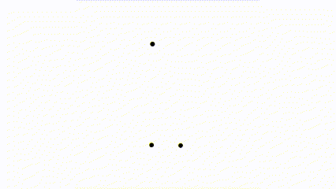

# N-body simulation

Given a system of celestial bodies (stars, planets,etc.), mutually affected by gravitational forces, describe their
motion. Each body has a mass and an initial position and velocity. Each other
body exerts an attraction force on it that depends on the masses and relative
distance.

## Project structure

* **.idea:** It contains project-specific settings from the IDE
* **data:** It contains files with the specificy body configuration.
* **src:** It contains the implemenation of the code.
    * **Body:** Stores the position, velocity and mass of a body.
    * **Main:** Generates a simulator.
    * **NBodySimulator:** Visual representation of bodies.
    * **Universe:** Contains bodies and calculate interactions of each force between them.
    * **Vector:** Defines a vector class and provides functions for creating and manipulating vectors.
* **model.puml:** Class diagrama of the project
* **nbody.iml:** It's a file that store information about a development module, such paths, dependencies and settings.
## Parameters
1. **Time** 
2. **PauseTime**
3. **Trace**
4. **path**

## Visualization
Executed with the next parameters:
`1000 0 trace data/3body.txt`

